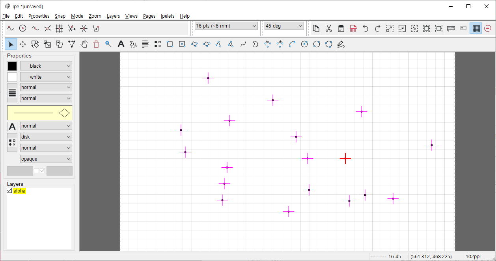
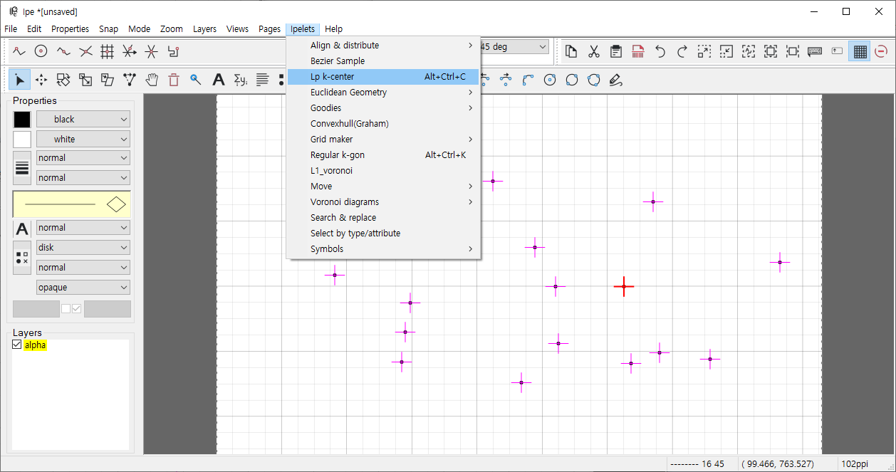
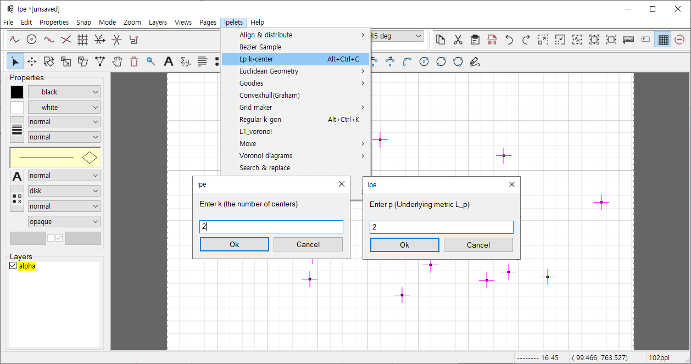
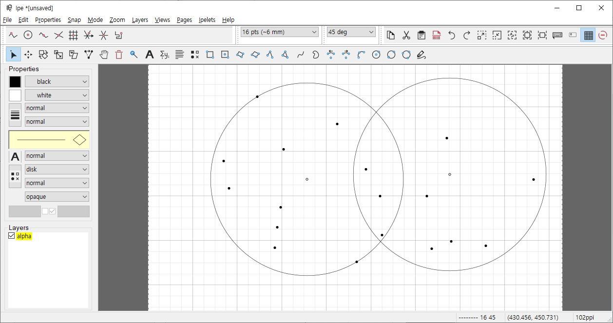

# *Lp* *k*-centers

## 1. Introduction
The Ipe extensible drawing editor is a tool used by computational geometry researchers to produce 2D figures for inclusion in articles or presentations. The latest version of the editor is ipe-7.2.24. There is no function to draw minimum enclosing disc, a.k.a. Euclidean (*L2*) 1-center for given points. It is a reason why we start the project drawing *Lp* *k*-centers, which can set various distance metrics (*Lp* metric) and the number of centers using C++ ipelet framework. This function can draw *Lp* *k*-centers of a point set given by user.

## 2. Algorithms 
Fundamentally, we use randomized algorithm to compute a center of points. It takes expected linear time to the number of points.
There are a few work for 2-center problems, but it is too complex to implement.
So, we separate a set of points into the several subsets, and find optimum solution using the properties of convexity of centers.
It takes expected *O(n^3)* time, so it works.
There are same properties for different *Lp* metric, so we just change the distunce function.

## 3. How to compile and Use
You can compile the file using the following instruction. Check it. [How to compile Ipelet (Windows)](https://github.com/postechDNN/postechDNN/blob/ipelet/dnn/IPELET/Readme.md)  
With compilation, you can use it in Ipe drawing editor. First select several number of points(>=2), and select the ipelet in "Ipelets" menu. Next you input *k* and *Lp* in order, then you can obtain congruent *Lp* *k*-centers.

## 4. Example

## 5. Update logs
### v0.99: Prototype
Support all *Lp* metric (infinity is 0), and *k*=1,2 only.  
*Lp* circle cannot exactly be computed, so we use bezier curve to draw it.  
Now it is just single cpp source code file.  
In present, there are some issues: (1) the ipelet cannot recognize transition and rotations of input points now, (2) bad approximation of bezier curves.
