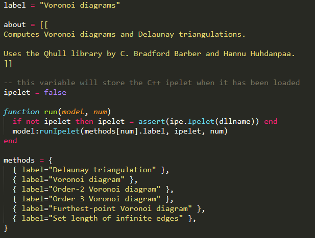

# How to compile Ipelet (Windows)

## Requirements

1. Install IPE (http://ipe.otfried.org) and mingw (match 32bit or 64bit)

2. Set environment variable for mingw

3. Add all ipe*.h files in Ipe/include to include folder of mingw  
(If mingw is installed at <strong>mingw</strong>, "<strong>mingw</strong>&#92;lib&#92;gcc&#92;<strong>Package</strong>-mingw32&#92;<strong>Version</strong>&#92;include" is possible folder)

## Compile

1. Generate *.o using bellow command
 > g++ -c -O2 -DWIN32 -fno-exceptions -fno-rtti -Iinclude <strong>filename</strong>

2. Generate dynamic link library(*.dll) using the ipe and *.o file generated by 1.
 > g++ -shared -o <strong>dll_name</strong>.dll <strong>object_file(s)</strong>.o -L<strong>directory_of_ipe.dll</strong> -lipe  
(For example, the directory_of_ipe.dll is bin if working directory is "ipe-version" that contains folder "bin" and "ipelets")  

3. Write *.lua using same name of dll file and move them into folder "ipelets". Then you can find new ipelet at ipe. (You have to re-run ipe.exe)
 - *.lua file can be written using example file (http://ipe.otfried.org/manual/cpp-ipelets.html) and recommand to modify "label" (the name appears on ipe) and "about" (description) in the contents.
 - You can integrate multiple functions using labeling  
 

* Referrence ipelib page for other details  
http://ipe.otfried.org/manual/index.html
