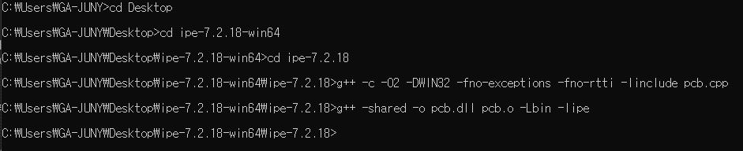
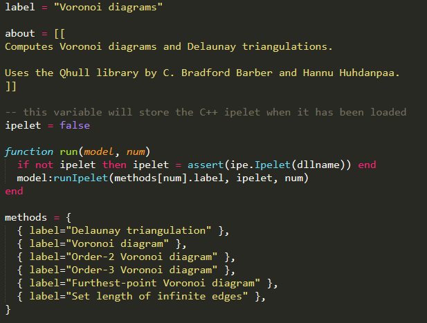

# Ipelet 컴파일 (Windows)

## Requirements

1. IPE (http://ipe.otfried.org) 및 mingw 설치 (32비트 혹은 64비트로 일치)

2. mingw 환경변수 설정

3. Ipe/include 내 ipe*.h 파일 모두 mingw의 include에 추가  
(mingw가 설치된 폴더가 <strong>mingw</strong> 인 경우 <strong>mingw</strong>&#92;lib&#92;gcc&#92;<strong>Package</strong>-mingw32&#92;<strong>Version</strong>&#92;include 아래)

## Compile

1. 다음 명령어로 \*.o파일 생성
 > g++ -c -O2 -DWIN32 -fno-exceptions -fno-rtti -Iinclude "파일명".cpp

2. 생성된 \*.o파일 및 ipe를 이용하여 라이브러리(*.dll) 생성
 > g++ -shared -o "생성할파일명".dll "생성된파일명".o -L"ipe경로" -lipe  
(만약 bin, ipelets 등이 포함된 폴더에서 작업하는 경우 "ipe경로"=bin)  

3. 생성된 *.dll파일과 같은 이름으로 *.lua 파일을 생성하고 ipelets폴더로 옮겨준 뒤 ipe를 실행하면 ipelet 항목에 추가됨.
 - lua파일은 예시파일(http://ipe.otfried.org/manual/cpp-ipelets.html 참조) 내의 label(ipelet 항목으로 나타나는 이름), about(설명)만 수정하여 사용
 - labeling을 통해 여러 함수를 하나의 lua로 묶어 사용 가능  
 

* 기타 class 등의 설명은 ipelib사이트 참조
http://ipe.otfried.org/manual/index.html
